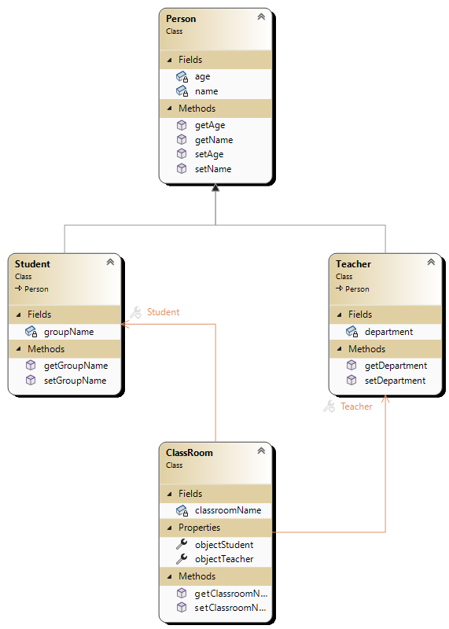

# esim6 Koostaminen

Tässä esimerkissä on luokat Person, Student ja Teacher, kuten esimerkissä 3.

Tässä on lisäksi luokka **ClassRoom**, joka **koostaa** eli sisältää luokkien Student ja Person olioita.
Kyseessä on siis **vahva kooste** eli **composition**.

Kannattaa tutkia erityisesti ClassRoom luokan koodia ja main.cpp:tä. 

VisualStudiolla tehtynä sovelluksen luokkakaavion näyttää tältä  

Tein esimerkissä niin, että main.cpp:ssä luodaan Classroom luokan olio. Classroomin konstruktorissa luodaan Student ja Teacher oliot. Niiden arvot kuitenkin asetetaan main.cpp:ssä, jonka sisältö on alla. 

## main.cpp 
<pre>
ClassRoom *objectClassroom = new ClassRoom;
objectClassroom-&gt;setClassroomName("5b301");

objectClassroom-&gt;objStudent1-&gt;setName("Teppo Testi");
objectClassroom-&gt;objStudent1-&gt;setBirthYear(1999);
objectClassroom-&gt;objStudent1-&gt;setGroupName("tvt23spl");

objectClassroom-&gt;objStudent2-&gt;setName("Liisa Joki");
objectClassroom-&gt;objStudent2-&gt;setBirthYear(1998);
objectClassroom-&gt;objStudent2-&gt;setGroupName("tvt23sp0");

objectClassroom-&gt;objTeacher-&gt;setName("Mauno Opettaja");
objectClassroom-&gt;objTeacher-&gt;setBirthYear(1982);
objectClassroom-&gt;objTeacher-&gt;setDepartment("Tietotekniikka");

objectClassroom-&gt;showClassroomData();

delete objectClassroom;
objectClassroom=nullptr;
return 0;
</pre>